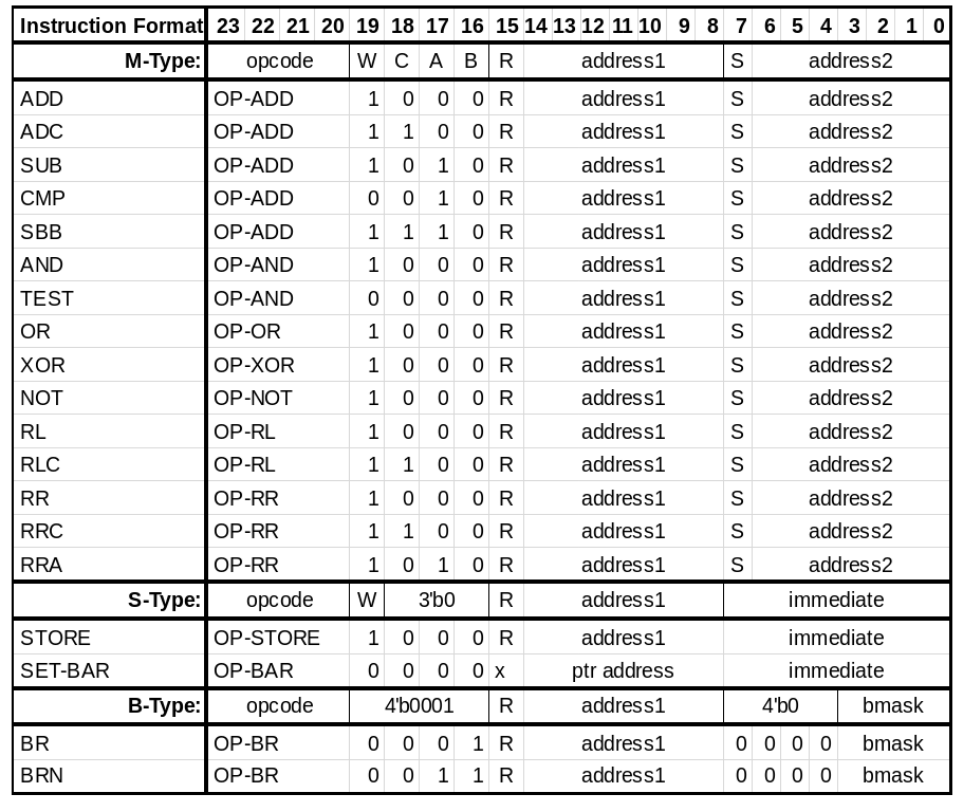

# TP-ISA

## Motivation

TP-ISA is a memory-memory ISA designed around the inkjet printed EGFET PDK
which supports low gate count, single cycle implementations.  The ISA and
benchmark results are described in our paper *Printed Microprocessors*,
published in [ISCA 2020](https://iscaconf.org/isca2020/).  A synthesizable,
parameterizable implementation of this ISA is present in `./rtl`.


## Memory Model

The computer uses a Harvard architecture consisting of an instruction
ROM with upto 256 instructions.  All instructions consist of 24 bits.
The data memory consists of (upto) 256 words of RAM.

## Registers

TP-ISA has the following architectural registers:

1. Program Counter (PC): 8-bits program sequencer
2. Base Address Register (BAR): 8-bit register used for calculating effective addresses
3. Flag registers which are set by all arithmetic instructions, as well as
CMP and TEST instructions.

```
[S, Z, C, V]
 |  |  |  |-> Overflow (set if carry in of msb is 1)
 |  |  |-> Carry (set if carry out of msb is 1), or borrow (if SUB)
 |  |-> Zero (set if result is zero)
 |-> Sign (set if the result is negative)
 ```

## Instruction Types

```
Mem-Mem:
    ADD     r(a1), s(a2)    ; M[ea1] <- M[ea1] + M[ea2]
    ADC     r(a1), s(a2)    ; M[ea1] <- M[ea1] + M[ea2] + Flags.C
    SUB     r(a1), s(a2)    ; M[ea1] <- M[ea1] + Not(M[ea2]) + 1
    CMP     r(a1), s(a2)    ; M[ea1] - M[ea2] (sets flags)
    SBB     r(a1), s(a2)    ; M[ea1] <- M[ea1] + Not(M[ea2]) +  Not(Flags.C)
    AND     r(a1), s(a2)    ; M[ea1] <- M[ea1] & M[ea2]
    TEST    r(a1), s(a2)    ; M[ea1] & M[ea2] (sets flags)
    OR      r(a1), s(a2)    ; M[ea1] <- M[ea1] | M[ea2]
    XOR     r(a1), s(a2)    ; M[ea1] <- M[ea1] ^ M[ea2]
    NOT     s(a2)           ; M[ea2] <- Not(M[ea2])
    RL      r(a1)           ; M[ea1] <- {M[ea1][6:0], 1'b0}
    RR      r(a1)           ; M[ea1] <- {1'b0, M[ea1][7:1]}
    RLC     r(a1)           ; M[ea1] <- {M[ea1][6:0], Flags.c}
    RRC     r(a1)           ; M[ea1] <- {Flags.c, M[ea1][7:1]}
    RRA     r(a1)           ; M[ea1] <- {M[ea1][7], M[ea1][7:1]}

STORE Mem:
    STORE a1, imm1 ; M[ea1] <- imm1
    SETBAR m1      ; BAR <- M[ea2]

Branching:
    BR bflags, a1  ; PC <- |(bflags & Flags) ? ea1 : PC + 1
    BRN bflags, a1 ; PC <- |(bflags & Not(Flags)) ? ea1 : PC + 1
```

Effective addresses (`ea1`, `ea2`) are calculated as
`ea1 = r ? a1 + BAR : a1` and similiarly `ea2 = s ? a2 + BAR : a2`.

## Instruction Encodings


